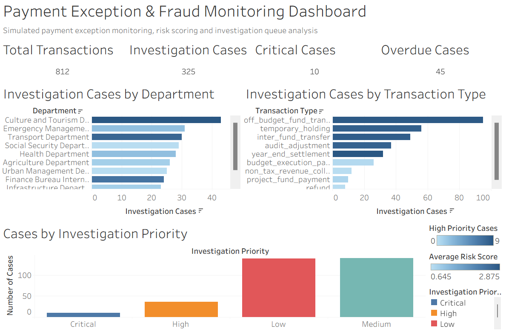
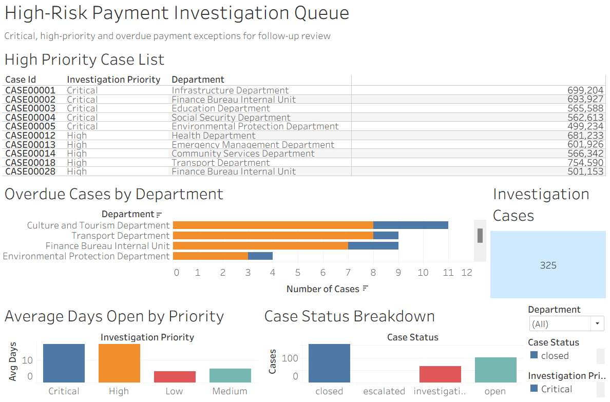

# Payment Exception & Fraud Monitoring Dashboard

## 1. Project Overview

This project simulates a payment exception and fraud monitoring workflow for finance, treasury and risk operations teams. It uses simulated payment transaction data to identify unusual payment patterns, missing documentation, duplicate payment patterns, large-value outliers, high-risk transfer activities and unresolved review items.

The project is inspired by practical treasury operations, voucher verification, payment discrepancy investigation, audit support and internal control monitoring scenarios.

All data used in this project is simulated. No confidential, real government, bank, audit, voucher, department, account or transaction data is used.

## 2. Business Problem

Finance, treasury and risk operations teams need to monitor payment transactions for potential exceptions and control risks. Common issues include duplicate payment patterns, missing supporting documents, abnormal transaction amounts, unusual transfer activities and unresolved investigation items.

A structured payment monitoring workflow can help teams prioritise high-risk items, support investigation queues and improve internal control follow-up.

This project demonstrates how rule-based risk indicators can be used to identify payment exceptions and convert flagged transactions into an investigation queue for further review.

## 3. Tools Used

* Python
* pandas
* Tableau Public
* Excel / CSV files
* VS Code

## 4. Data Design

The project uses simulated datasets:

* `payment_transactions.csv`: simulated payment transaction data copied from the treasury reconciliation project
* `payment_risk_flags.csv`: transaction-level risk flag dataset
* `payment_investigation_queue.csv`: case-level investigation queue dataset
* `payment_monitoring_overview.csv`: dashboard KPI summary table
* `department_risk_summary.csv`: department-level risk summary
* `transaction_type_risk_summary.csv`: transaction-type risk summary
* `high_priority_case_list.csv`: critical and high-priority case list
* `overdue_case_summary.csv`: overdue case summary by department and priority

## 5. Workflow

1. Prepared simulated payment transaction data.
2. Created rule-based payment risk indicators.
3. Generated risk scores and risk levels for each transaction.
4. Converted flagged transactions into a case-level investigation queue.
5. Added case owners, case status, days open, overdue flags and follow-up actions.
6. Generated management-level summary datasets by department, transaction type, investigation priority and overdue status.
7. Built Tableau dashboards for payment risk monitoring and high-risk investigation queue management.

## 6. Risk Rules

The rule-based monitoring logic includes:

* Large amount transaction flag
* High-risk transaction type flag
* Duplicate payment pattern flag
* Year-end transaction flag
* High-activity department flag
* Overdue investigation case flag
* Second-level review indicator

The risk score is designed for portfolio demonstration and is not an official fraud detection model.

## 7. Dashboard Outputs

### Payment Risk Overview

This dashboard provides a management-level overview of payment risk monitoring results. It includes KPI cards for total transactions, investigation cases, critical cases and overdue cases. It also includes charts showing investigation cases by department, investigation cases by transaction type and case counts by investigation priority.

### High-Risk Investigation Queue

This dashboard focuses on critical, high-priority and overdue payment exception cases. It includes a high-priority case list, overdue cases by department, average days open by priority, case status breakdown and interactive filters for investigation follow-up.

## 8. Key Results

* Analysed 812 simulated payment transactions.
* Generated 325 investigation cases.
* Identified 10 critical cases and 36 high-priority cases.
* Flagged 45 overdue cases.
* Built two Tableau dashboard pages for payment risk monitoring and investigation queue management.

## 9. Skills Demonstrated

* Payment exception monitoring
* Rule-based risk scoring
* Investigation queue design
* Fraud-risk thinking
* Internal control analytics
* Python and pandas data transformation
* Tableau dashboard design
* Risk operations reporting
* Case prioritisation and follow-up workflow

## 10. Confidentiality Statement

This project does not use any real government, bank, audit, voucher, account, department or transaction data. All datasets are simulated for portfolio purposes. The project is designed to demonstrate payment exception monitoring, fraud-risk thinking, internal control analytics and dashboard reporting skills without disclosing any confidential information.

## 11. Project Development Log

### Day 1 Log

Created the project folder structure, prepared the README file, copied simulated payment transaction data from the treasury reconciliation project and tested the Python environment.

### Day 2 Log

Created the first version of rule-based payment risk flags using Python and pandas. The rules identify large-amount transactions, high-risk transaction types, duplicate payment patterns, year-end transactions and high-activity departments.

A risk score and risk level were created for each transaction, along with a recommended investigation action and a readable risk flag summary. The output file is saved as `data/payment_risk_flags.csv`.

### Day 3 Log

Created an investigation queue based on the payment risk flags generated on Day 2. Transactions with medium or high risk levels, large amount flags, duplicate patterns or high-risk transaction types were selected for follow-up review.

The investigation queue includes case IDs, case owners, case status, days open, overdue flags, second-review indicators, investigation priority levels, investigation notes and follow-up actions.

The output file is saved as `data/payment_investigation_queue.csv`. This dataset is used to build Tableau dashboards for payment risk monitoring and investigation queue management.

### Day 4 Log

Generated payment monitoring summary datasets for dashboard preparation. The summaries include management-level overview metrics, department-level risk summaries, transaction-type risk summaries, high-priority case lists and overdue case summaries.

These outputs were created from `payment_risk_flags.csv` and `payment_investigation_queue.csv`. The summary tables are used as Tableau data sources for the payment exception and fraud monitoring dashboard.

The output files include `payment_monitoring_overview.csv`, `department_risk_summary.csv`, `transaction_type_risk_summary.csv`, `high_priority_case_list.csv` and `overdue_case_summary.csv`.

### Day 5 Log

Created the first Tableau dashboard page for the payment exception and fraud monitoring project: Payment Risk Monitoring Overview.

The dashboard includes KPI cards for total transactions, investigation cases, critical cases and overdue cases. It also includes charts showing investigation cases by department, investigation cases by transaction type and case counts by investigation priority.

This dashboard page is designed to provide a management-level overview of payment risk monitoring results and support prioritisation of investigation resources.

The dashboard screenshot is saved as `tableau/dashboard_payment_risk_overview.png`.

### Day 6 Log

Created the second Tableau dashboard page for the payment exception and fraud monitoring project: High-Risk Payment Investigation Queue.

This dashboard focuses on critical, high-priority and overdue payment exception cases. It includes a high-priority case list, overdue cases by department, average days open by priority, case status breakdown and interactive filters for follow-up review.

The purpose of this dashboard page is to support investigation queue management, escalation review and follow-up prioritisation for payment risk monitoring.

The dashboard screenshot is saved as `tableau/dashboard_investigation_queue.png`.
